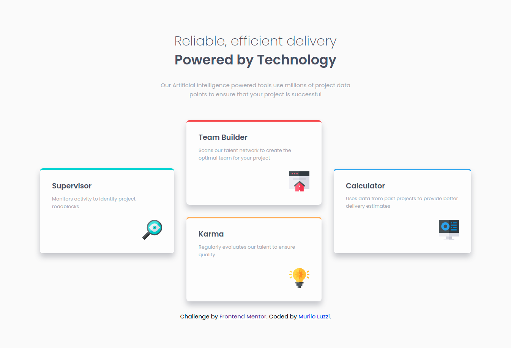

# Frontend Mentor - Four card feature section solution

This is a solution to the [Four card feature section challenge on Frontend Mentor](https://www.frontendmentor.io/challenges/four-card-feature-section-weK1eFYK). Frontend Mentor challenges help you improve your coding skills by building realistic projects. 

## Table of contents

- [Overview](#overview)
  - [The challenge](#the-challenge)
  - [Screenshot](#screenshot)
- [My process](#my-process)
  - [Built with](#built-with)
  - [What I learned](#what-i-learned)
  - [Continued development](#continued-development)
- [Author](#author)

## Overview

### The challenge

Users should be able to:

- View the optimal layout for the site depending on their device's screen size

### Screenshot

### Links

- Live Site URL: https://mlzzi.github.io/four-card-feature-section-master/

## My process

### Built with

- Semantic HTML5 markup
- CSS custom properties
- Flexbox
- Mobile-first workflow
- BEM methodology

### What I learned

I've used Flexbox to position the elements and it was quite a challenge. I believe that may be a elegantier solution, but it worked.

### Continued development

Next steps is continue the practice and start apply javascript in future challenges.

## Author

- Linkedin - https://www.linkedin.com/in/muriloluzzi/
- Frontend Mentor - [@mlzzi](https://www.frontendmentor.io/profile/mlzzi)